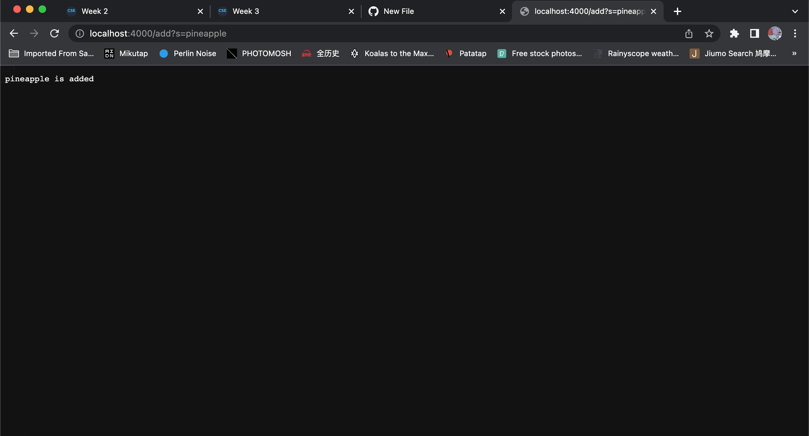
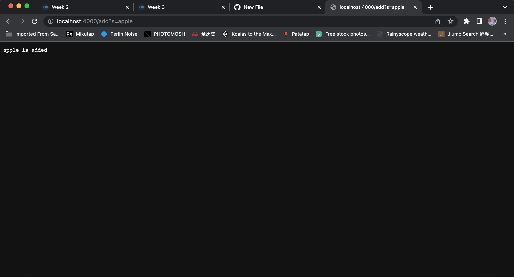
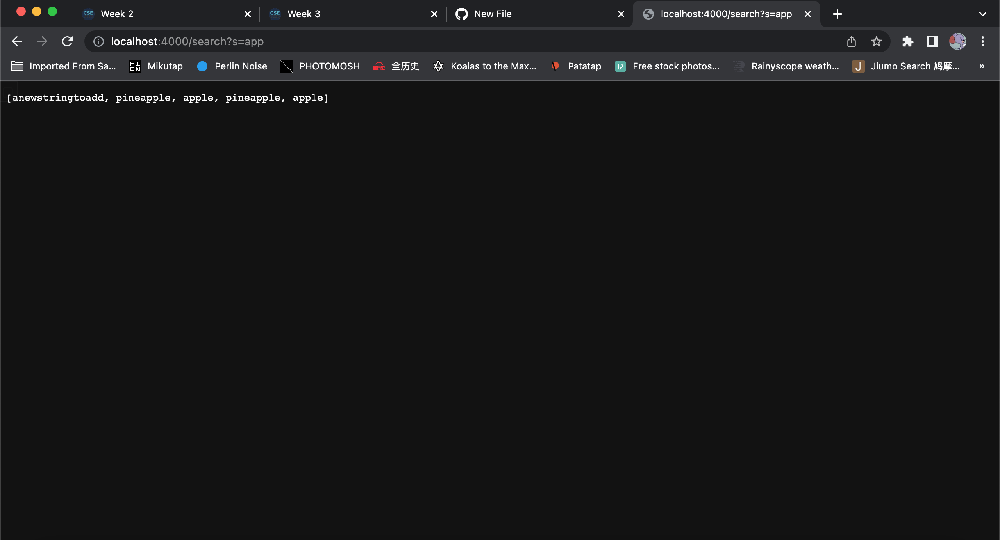

# Lab Report 2

1. Part 1 Simplest Search Engine

Code:
`import java.io.IOException;
import java.net.URI;
import java.util.ArrayList;

class Handler implements URLHandler {

    ArrayList<String> list = new ArrayList<>();
    public String handleRequest(URI url) {
        if (url.getPath().contains("/add")) {
            String[] parameters = url.getQuery().split("=");
            if (parameters[0].equals("s")) {
                list.add(parameters[1]);
                return parameters[1] + " is added";
                }
        }
        else if(url.getPath().contains("/search")) {
            ArrayList<String> SearchList = new ArrayList<>();
            String[] parameter= url.getQuery().split("=");
            if (parameter[0].equals("s")) {
                for(String element:list){
                    element.contains(parameter[1]);
                    SearchList.add(element);
                }
                return SearchList.toString();
            }
        }
        return "404 Not Found!";

    }
}

class SearchEngine {
    public static void main(String[] args) throws IOException {

        if(args.length == 0){
            System.out.println("Missing port number! Try any number between 1024 to 49151");
            return;
        }

        int port = Integer.parseInt(args[0]);

        Server.start(port, new Handler());
    }
}`

*add 'pineapple' to the list

*add 'apple' to the list

*print out what are in the list(I tried adding before so right now it has 2 pineapples, 2 apples, and 1 anewstringtoadd)

2. Part 2 Choose two of the bugs from different files above

*Array Methods

The failure inducing input for me was {1,2,3,4,5}. The symptom was that Arrays first differed at element [3]; expected:<2> but was:<4>.

..E.
Time: 0.05
There was 1 failure:
1) testReverse2(ArrayTests)
arrays first differed at element [3]; expected:<2> but was:<4>
        at org.junit.internal.ComparisonCriteria.arrayEquals(ComparisonCriteria.java:78)
        at org.junit.internal.ComparisonCriteria.arrayEquals(ComparisonCriteria.java:28)
        at org.junit.Assert.internalArrayEquals(Assert.java:534)
        at org.junit.Assert.assertArrayEquals(Assert.java:418)
        at org.junit.Assert.assertArrayEquals(Assert.java:429)
        at ArrayTests.testReverse2(ArrayTests.java:23)
        ... 32 trimmed
Caused by: java.lang.AssertionError: expected:<2> but was:<4>
        at org.junit.Assert.fail(Assert.java:89)
        at org.junit.Assert.failNotEquals(Assert.java:835)
        at org.junit.Assert.assertEquals(Assert.java:120)
        at org.junit.Assert.assertEquals(Assert.java:146)
        at org.junit.internal.ExactComparisonCriteria.assertElementsEqual(ExactComparisonCriteria.java:8)
        at org.junit.internal.ComparisonCriteria.arrayEquals(ComparisonCriteria.java:76)
        ... 38 more

FAILURES!!!
Tests run: 3,  Failures: 1

Test I wrote:
`@Test
 public void testReverse2(){
   int [] input2 = {1,2,3,4,5};
   ArrayExamples.reverseInPlace(input2);
   assertArrayEquals(new int[]{5,4,3,2,1},input2);
 }`

To avoid it, I changed it to have a variable to store the values
`static void reverseInPlace(int[] arr) {
   for(int i = 0; i < arr.length/2; i += 1) { 
     int temp = arr[i];
     arr[i] = arr[arr.length - i - 1];
     arr[arr.length-i-1] = temp;
   }
 }`

*List Methods

Test I wrote:
`public class ListTests {
   @Test
   public void ListTest1() {
       List<String> input = new ArrayList<String>();
       input.add("apple");
       input.add("banana");
       input.add("orange");
       StringChecker SC = new StrCh();
       input = ListExamples.filter(input,SC);
       List<String> output = new ArrayList<String>();  
       output.add("banana");
       output.add("orange");
       assertEquals(output,input);
   }      
}`

The syptom is 

.E
Time: 0.08
There was 1 failure:
1) ListTest1(ListTests)
java.lang.AssertionError: expected:<[banana, orange]> but was:<[orange, banana]>
        at org.junit.Assert.fail(Assert.java:89)
        at org.junit.Assert.failNotEquals(Assert.java:835)
        at org.junit.Assert.assertEquals(Assert.java:120)
        at org.junit.Assert.assertEquals(Assert.java:146)
        at ListTests.ListTest1(ListTests.java:20)

FAILURES!!!
Tests run: 1,  Failures: 1

The problem with the code of this method is that the list is returned in an opposite order, so I thought of just adding s to the end 
  
To fix the problem, I changed it to be 
  `static List<String> filter(List<String> list, StringChecker sc) {
   List<String> result = new ArrayList<>();
   for(String s: list) {
     if(sc.checkString(s)) {
       result.add(s);
     }
   }`

