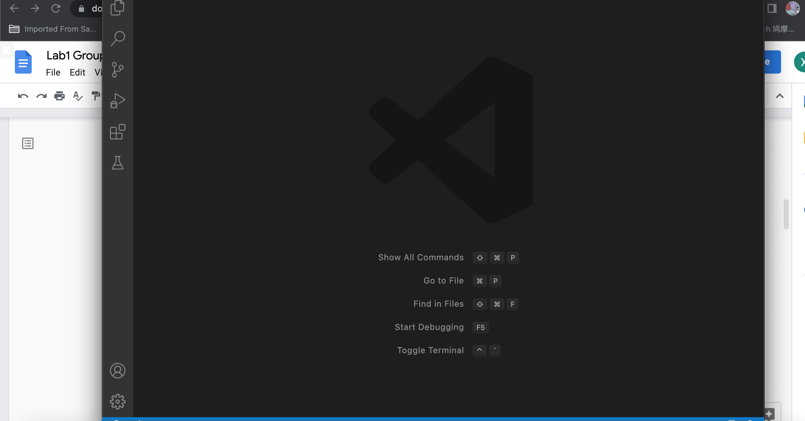
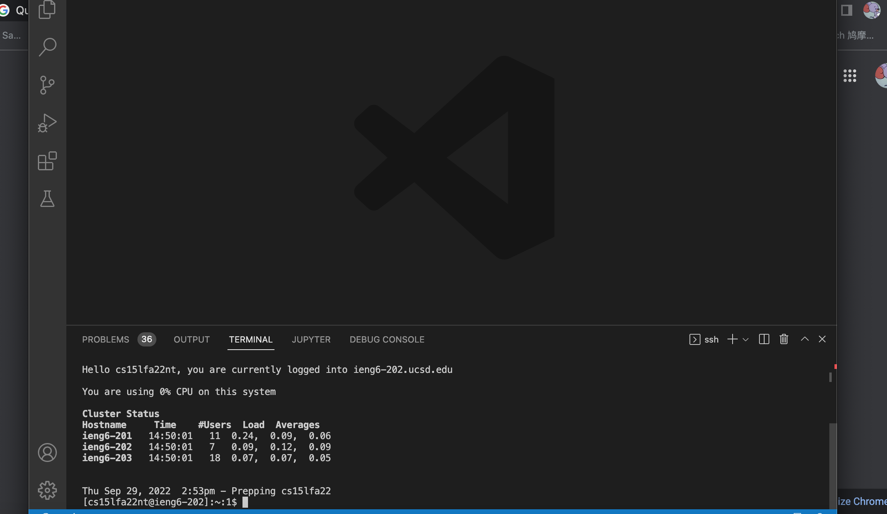
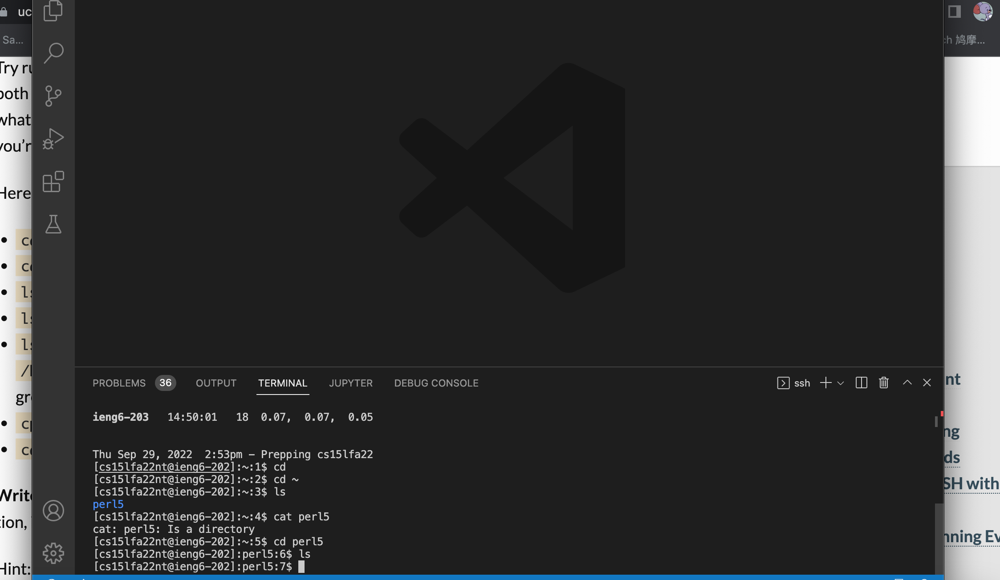
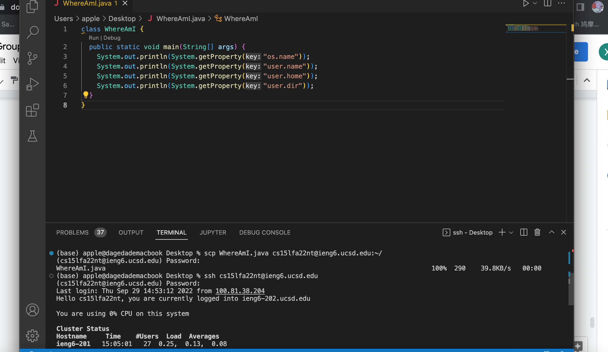
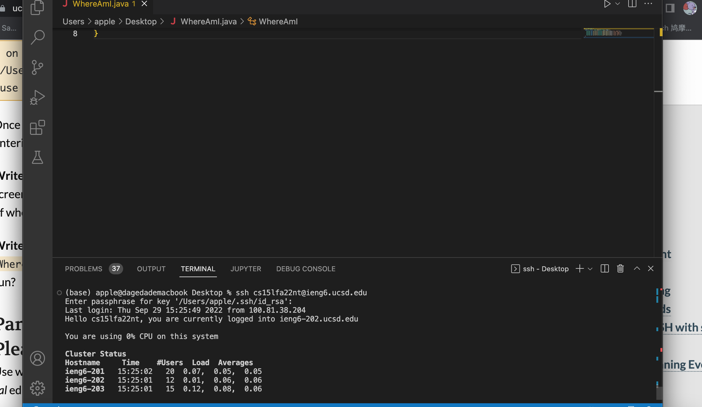
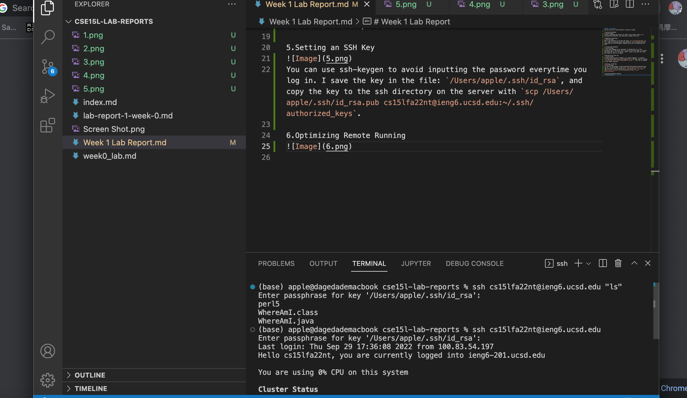
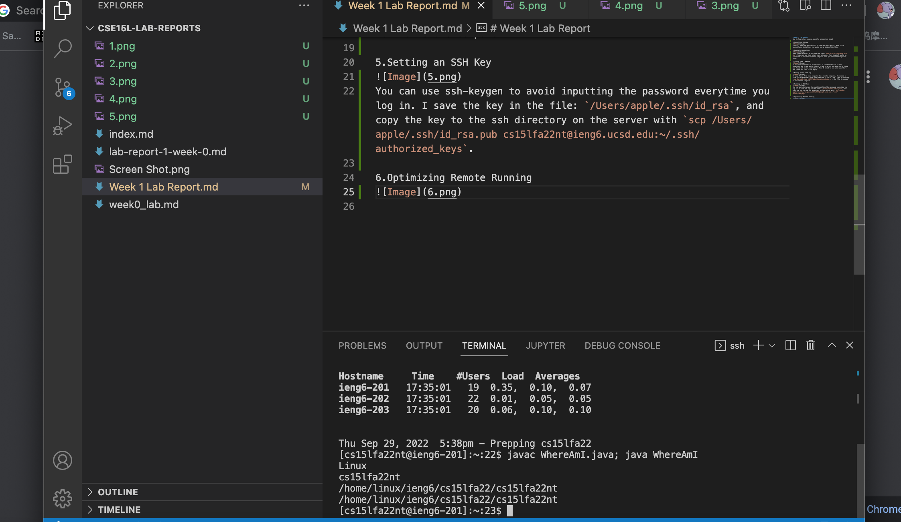

# Week 1 Lab Report
How to log into a course-specific account on ieng6

1.Installing VScode

Firstly, download and install VS Code on your device. When it is successfully installed, you would see a window like this.

2.Remotely Connecting

Open a new terminal on VS Code and input `ssh cs15lfa22nt@ieng6.ucsd.edu`, type yes and then enter your password. Your terminal would be connected to the CSE basement computer once you see something like this.

3.Trying Some Commands

To try some commands on my terminal, I checked what is in the directory and I see perl5, then I tried to print out what is in there and found out it is a directory. Then I tried to see what was there and found out that it is empty. 

4.Moving Files with scp

To copy files from your computer to a remote computer, I created a file called WhereAmI.java, and compiled it in VS Code. Then by running `scp WhereAmI.java cs15lfa22nt@ieng6.ucsd.edu:~/`, the file is copied to the remote computer. 

5.Setting an SSH Key

You can use ssh-keygen to avoid inputting the password everytime you log in. I save the key in the file: `/Users/apple/.ssh/id_rsa`, and copy the key to the ssh directory on the server with `scp /Users/apple/.ssh/id_rsa.pub cs15lfa22nt@ieng6.ucsd.edu:~/.ssh/authorized_keys`.

6.Optimizing Remote Running

To have a more pleasant time with remote running, you can try more lines to make it more convenient. I tried `$ ssh cs15lfa22nt@ieng6.ucsd.edu "ls"` so that I can see the directory on the server without logging in and exitting. I also tried `javac WhereAmI.java; java WhereAmI` on the server so that I can compile and run the java file with one line.