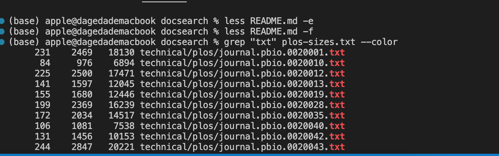

#Week 5 Lab Report
1. Find command-line options: ```-iname pattern```

Just like name, true if the last component of the pathname being examined matches pattern, but the match is case insensitive.

Command I put in:
```(base) apple@dagedademacbook docsearch %  find technical/ -iname CHaPTer-1.txt```

Result I got:
```technical//911report/chapter-1.txt```

This is important becasue it is more convenient than name method, since it is not case sensitive, so it would be easier to search.

2. Find command-line options: ```-user uname```

True if the file belongs to the user uname. If the username is correct, it will print out all files in technical.

Command I put in:
```(base) apple@dagedademacbook docsearch % find technical/ -user apple```

Result I got:
```technical//plos/pmed.0010048.txt
technical//plos/pmed.0010060.txt
technical//plos/journal.pbio.0030137.txt
technical//plos/journal.pbio.0030136.txt
technical//plos/pmed.0010061.txt
```
and so on

This is important because it makes access files in terminal more safe, since you can check the username and access. 

3. Find command-line options: ```-empty``` 

True if the current file or directory is empty. Then it would print out the empty file. 

Command I put in:
```(base) apple@dagedademacbook docsearch % find technical/ -empty```

Result I got:
```technical//plos-sizes.txt```

This is important because it checks and searches the empty file if you need to.

4. Less command-line options: ```-V or --version```

It displays the version number of less.

Command I put in:
```(base) apple@dagedademacbook docsearch % less -V```

Result I got:
```less 581.2 (POSIX regular expressions)
Copyright (C) 1984-2021  Mark Nudelman

less comes with NO WARRANTY, to the extent permitted by law.
For information about the terms of redistribution,
see the file named README in the less distribution.
Home page: https://greenwoodsoftware.com/less
```

This is important because it shows the version of less so you can check whether it is updated or whether it needs to be updated.

5. Less command-line options:```-E or --QUIT-AT-EOF```

Causes less to automatically exit.

Command I put in:
```(base) apple@dagedademacbook docsearch % less README.md -e```

Result I got:
```The technical/ directory is a subdirectory of
https://anc.org/data/oanc/download/

~
```

This is important because it quits automatically so it could save time.

6. Less command-line options: ```-f or --force```

Forces non-regular(a directory or a device special file) files to be opened.   

Command I put in:
```(base) apple@dagedademacbook docsearch % less README.md -f```

Result I got:
```The technical/ directory is a subdirectory of
https://anc.org/data/oanc/download/

(END) - Next: -f
```

This is important because you get to force to open certain files that could be unprocessable by less.

7. Grep command-line options: --colour, --color

Mark up the matching text with the expression stored in differnt colors

Command I put in:
```(base) apple@dagedademacbook docsearch % grep "txt" plos-sizes.txt --color```

Result I got:
 ```231    2469   18130 technical/plos/journal.pbio.0020001.txt
      84     976    6894 technical/plos/journal.pbio.0020010.txt
     225    2500   17471 technical/plos/journal.pbio.0020012.txt
     141    1597   12045 technical/plos/journal.pbio.0020013.txt
     155    1680   12446 technical/plos/journal.pbio.0020019.txt
     199    2369   16239 technical/plos/journal.pbio.0020028.txt
     172    2034   14517 technical/plos/journal.pbio.0020035.txt
``` 


This is important because it is easier to see which files contain certain contents since they are colored. 

8. Grep command-line options: ```-n, --line-number```

Each output line is preceded by its relative line number in the file.

Command I put in:
```(base) apple@dagedademacbook docsearch % grep ".txt" plos-sizes.txt -n```

Result I got:
```2:technical/plos/pmed.0020273.txt
3:technical/plos/journal.pbio.0030032.txt
4:technical/plos/pmed.0020065.txt
5:technical/plos/pmed.0020071.txt
6:technical/plos/pmed.0020059.txt
7:technical/plos/pmed.0010039.txt
8:technical/plos/journal.pbio.0020354.txt
9:technical/plos/pmed.0010010.txt
10:technical/plos/journal.pbio.0020156.txt
11:technical/plos/pmed.0020104.txt
```
and so on

This is important because it displays line number on the left of each line so it is more clearly visible and easier for people to process data from a certain line.

9. Grep command-line options: ```-H```    

Always print filename headers with output lines.

Command I put in:
```(base) apple@dagedademacbook docsearch %  grep ".txt" plos-sizes.txt -H```

Result I got:
```
plos-sizes.txt:     231    2469   18130 technical/plos/journal.pbio.0020001.txt
plos-sizes.txt:      84     976    6894 technical/plos/journal.pbio.0020010.txt
plos-sizes.txt:     225    2500   17471 technical/plos/journal.pbio.0020012.txt
plos-sizes.txt:     141    1597   12045 technical/plos/journal.pbio.0020013.txt
plos-sizes.txt:     155    1680   12446 technical/plos/journal.pbio.0020019.txt
plos-sizes.txt:     199    2369   16239 technical/plos/journal.pbio.0020028.txt
plos-sizes.txt:     172    2034   14517 technical/plos/journal.pbio.0020035.txt
plos-sizes.txt:     106    1081    7538 technical/plos/journal.pbio.0020040.txt
plos-sizes.txt:     131    1456   10153 technical/plos/journal.pbio.0020042.txt
plos-sizes.txt:     244    2847   20221 technical/plos/journal.pbio.0020043.txt
plos-sizes.txt:     232    2559   19069 technical/plos/journal.pbio.0020046.txt
plos-sizes.txt:      73     816    5847 technical/plos/journal.pbio.0020047.txt
plos-sizes.txt:     182    2112   15002 technical/plos/journal.pbio.0020052.txt
```
and so on

This is important because it is more clearly visible since it displays the file name on the left of each line. 
