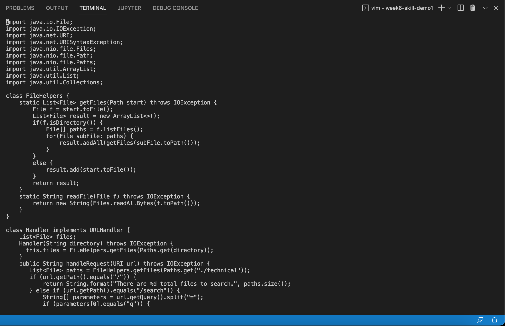
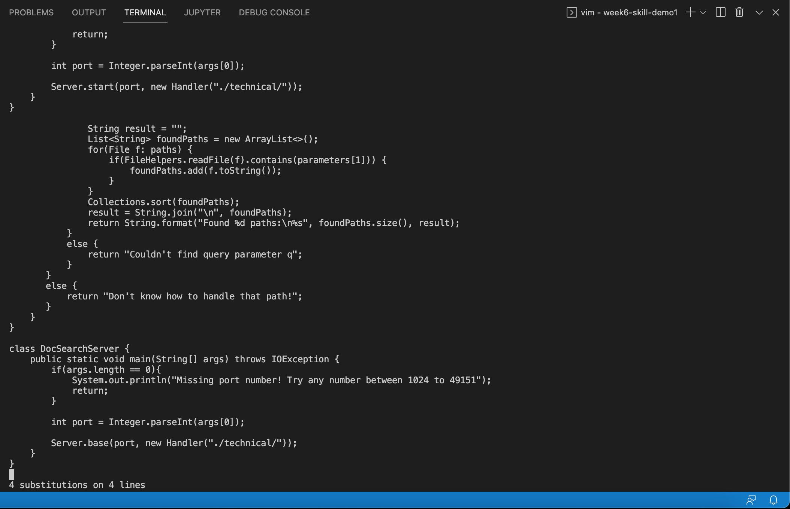
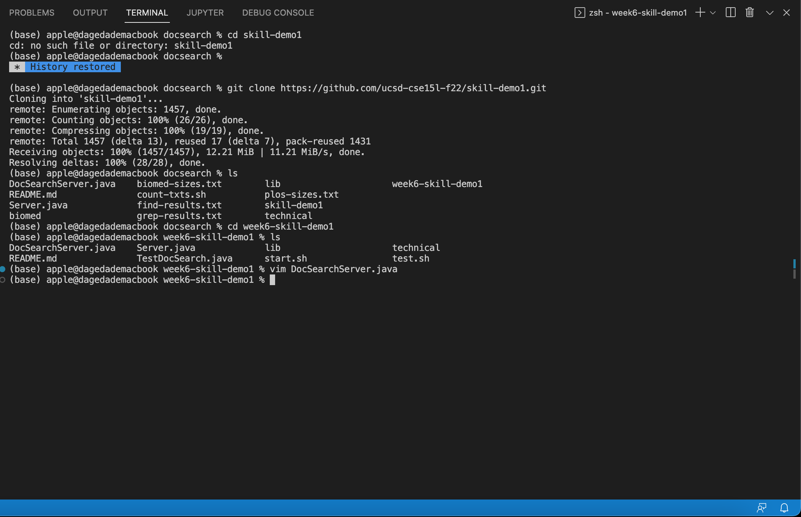

#Week 7 Lab Report

1.Vim Task
Changing the name of the start parameter and its uses to base

```vim DocSearchServer.java```
Use vim to open the DocSearchServer.java


```:%s/start/base<Enter>```
Use % to interate in the whole file, then use :s to subsitute, then replace start with base.


```:wq<Enter>```
Save and exit.


2.Compare two methods
```scp```
It takes me about three minutes. It is a long process since I have to log in and put in the passwords. 

```Vim```
It takes me about two minutes, this saves a lot of time than scp. 

Now I prefer the scp method although it takes me more time, since I am still a bit unfamilar with the vim method. I have to look up the methods. 
Although scp requires logging in, but editing on VS code is easier for me. 

It depends on the assignment, I would use VIM to find or replace words, but if there is more I would use scp on VS code. 
