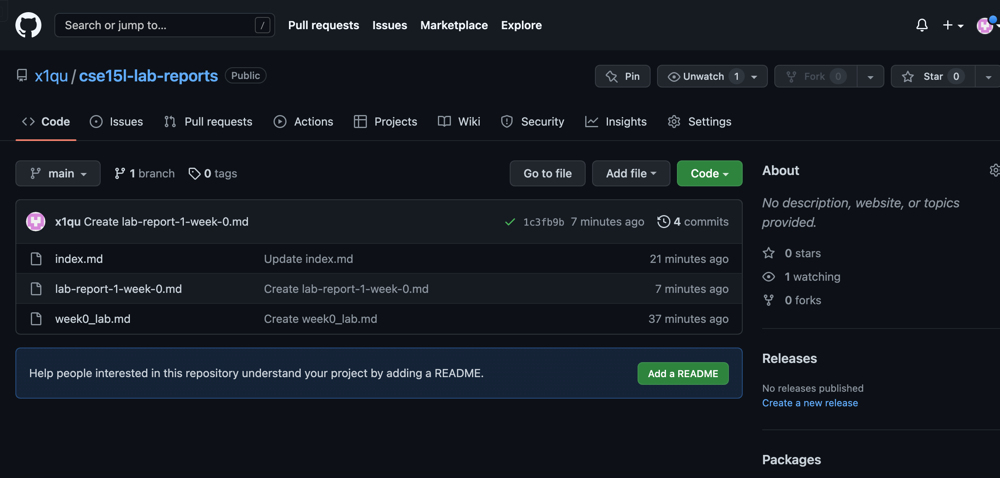

# Hello, World!
## Hello, World pt.2!
**Hello, World!**
*Hello, World!*
> Hello, World!
1. One
2. Two
3. Three
* Four
* Five
* Six

Hello, World:

***
`code: Hello, World!`
[cse15l-lab-reports](http://a.com)
*VS CODE SAVE*

