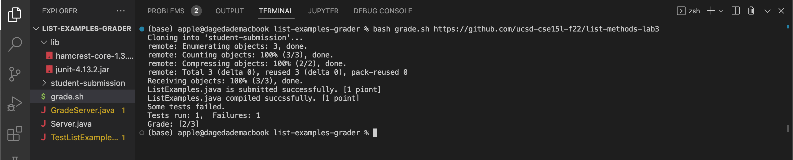
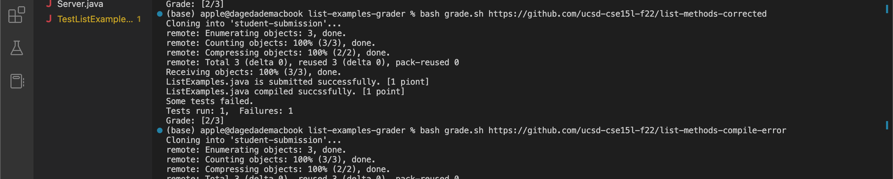
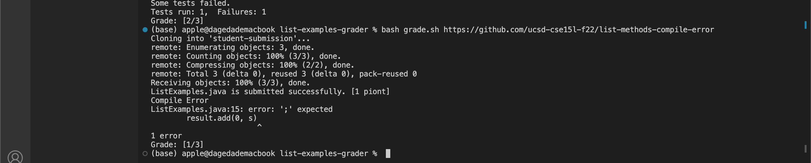

# Lab Report week 9

1. code:
```

#set -e
 
rm -rf student-submission
git clone $1 student-submission
 
score=0
 
FILE=student-submission/ListExamples.java
SUBMISSION_FILE=ListExamples.java
if [[ -f "$FILE" ]]
then
   echo "$SUBMISSION_FILE is submitted successfully. [1 piont]"
   ((score+=1))
else
   echo "$SUBMISSION_FILE is not found."
   echo "Grade: [$score/3]"
   exit
fi
 

cp TestListExamples.java student-submission
cp -rf lib student-submission
cd student-submission
CPATH=".:lib/hamcrest-core-1.3.jar:lib/junit-4.13.2.jar"
 
javac -cp $CPATH *.java 2> compile_error.txt

if [[ $? -eq 0 ]]; then
    echo "$SUBMISSION_FILE compiled succssfully. [1 point]"
    ((score+=1))
 
else
    echo "Compile Error"
    cat compile_error.txt
    echo "Grade: [$score/3]"
    exit
fi


java -cp $CPATH org.junit.runner.JUnitCore TestListExamples > test_result.txt
if [[ $? -eq 0 ]];then
   echo "All tests passed. [1 point]"
   ((score+=1))
else
   echo "Some tests failed."
   grep "Tests run" test_result.txt
fi
echo "Grade: [$score/3]"

```
2. screenshots:
https://github.com/ucsd-cse15l-f22/list-methods-lab3

https://github.com/ucsd-cse15l-f22/list-methods-corrected

https://github.com/ucsd-cse15l-f22/list-methods-compile-error


3.trace
I chose https://github.com/ucsd-cse15l-f22/list-methods-compile-error
```
FILE=student-submission/ListExamples.java
SUBMISSION_FILE=ListExamples.java
if [[ -f "$FILE" ]]
then
   echo "$SUBMISSION_FILE is submitted successfully. [1 piont]"
   ((score+=1))
```
This is to check whether the file exists, and it is true if returns `ListExamples.java is submitted successfully. [1 piont]`
```
javac -cp $CPATH *.java 2> compile_error.txt

if [[ $? -eq 0 ]]; then
    echo "$SUBMISSION_FILE compiled succssfully. [1 point]"
    ((score+=1))
 
else
    echo "Compile Error"
    cat compile_error.txt
    echo "Grade: [$score/3]"
    exit
fi
```

This is to check whether the file can be compiled, since the file has a syntax error of a missing semicolon, 
it is false so returns ```Compile Error
ListExamples.java:15: error: ';' expected
        result.add(0, s)
                        ^
1 error
Grade: [1/3]```

and then exits and shows the score.
